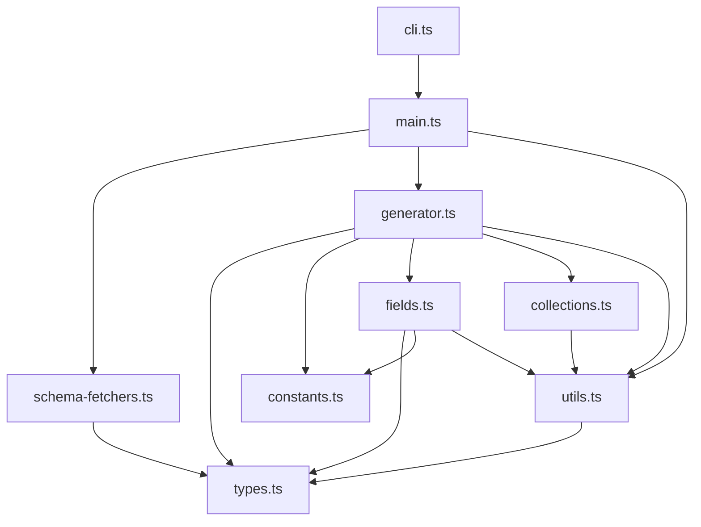

# PocketBase Zod Generator - Architecture Overview

## Project Structure

```
src/
├── main.ts           # Main orchestration and entry point
├── cli.ts            # Command-line interface
├── types.ts          # Core type definitions
├── generator.ts      # Core generation logic
├── schema-fetchers.ts # Data source strategies
├── fields.ts         # Field type mapping and processing
├── constants.ts      # Code templates and constants
├── utils.ts          # Utility functions
└── collections.ts    # Collection enum generation
```

## Design Patterns

### 1. Strategy Pattern
- **Schema Fetchers**: Multiple strategies for retrieving PocketBase schemas
  - `fromDatabase()` - Direct SQLite access
  - `fromJSON()` - JSON file parsing
  - `fromURLWithToken()` - API with token auth
  - `fromURLWithPassword()` - API with email/password auth

### 2. Template Method Pattern
- **Code Generation**: Consistent structure for generated TypeScript code
- **Field Processing**: Standardized approach to field type conversion

### 3. Factory Pattern
- **Field Type Mapping**: `pbSchemaZodMap` creates appropriate Zod schemas
- **System Fields**: Different schemas for base vs auth collections

### 4. Facade Pattern
- **Main Module**: Abstracts complexity of different input sources
- **CLI Module**: Simplifies command-line interaction

## Data Flow

```mermaid
graph TD
    A[CLI Input] --> B[Main Controller]
    B --> C{Input Source}
    C -->|--db| D[fromDatabase]
    C -->|--json| E[fromJSON]
    C -->|--url + token| F[fromURLWithToken]
    C -->|--url + email/pwd| G[fromURLWithPassword]
    C -->|--env| H[Environment Variables]
    
    D --> I[PocketBaseCollection[]]
    E --> I
    F --> I
    G --> I
    H --> I
    
    I --> J[Generator.generate()]
    J --> K[createCollectionSchema()]
    K --> L[createSelectOptions()]
    K --> M[createZodField()]
    K --> N[System Fields Merge]
    
    L --> O[Generated Code String]
    M --> O
    N --> O
    
    O --> P[saveFile()]
    P --> Q[Output .ts File]
```

## Core Components

### 1. Schema Processing Pipeline
1. **Input**: Multiple sources (DB, JSON, API)
2. **Transformation**: PocketBase schema → Internal types
3. **Generation**: Internal types → Zod schemas
4. **Output**: TypeScript file with schemas and types

### 2. Field Type System
- **Base Types**: text, number, bool, email, url, date, password
- **Special Types**: select (with enums), json, file, relation, editor
- **Modifiers**: required/optional, array (multi-select)
- **Validation**: Email, URL, datetime, string length

### 3. System Fields Architecture
- **Base Collections**: id, collectionId, collectionName, created, updated, expand
- **Auth Collections**: Extends base with email, emailVisibility, username, verified
- **Type Safety**: Separate record vs response schemas

## Key Design Decisions

### 1. Type Safety First
- Strong TypeScript typing throughout
- Zod schemas provide runtime validation
- Generated types match PocketBase API responses

### 2. Extensibility
- Plugin architecture for field types
- Easy to add new schema sources
- Modular component design

### 3. Code Generation Strategy
- Template-based approach for consistency
- String concatenation for performance
- Sorted output for deterministic results

### 4. Error Handling
- Graceful fallbacks for unknown field types
- Clear error messages for configuration issues
- Process exit on authentication failures

## Module Dependencies



## Performance Considerations

### 1. Batch Processing
- Fetches all collections in parallel where possible
- Minimal database queries (single `_collections` table read)

### 2. Memory Efficiency
- Streaming approach for large schemas
- Template-based generation avoids AST overhead

### 3. Caching Strategy
- No built-in caching (stateless design)
- File system write is final step

## Security Considerations

### 1. Authentication
- Supports both token and email/password auth
- Environment variable support for credentials
- FormData for PocketBase API compatibility

### 2. Input Validation
- Type checking on all inputs
- Sanitization of field names
- Safe file path handling

### 3. Generated Code Safety
- No code injection risks (template-based)
- Proper escaping of field names
- Const assertions for type safety

## Extension Points

### 1. New Field Types
- Add to `pbSchemaZodMap` in `fields.ts`
- Define validation rules and array handling

### 2. New Schema Sources
- Implement `SchemaFetcher` interface
- Add to main.ts orchestration logic

### 3. Custom Output Formats
- Modify `generator.ts` for different templates
- Add new constant templates in `constants.ts`

### 4. Advanced Validation
- Extend field processing in `fields.ts`
- Add custom Zod validators in `constants.ts`