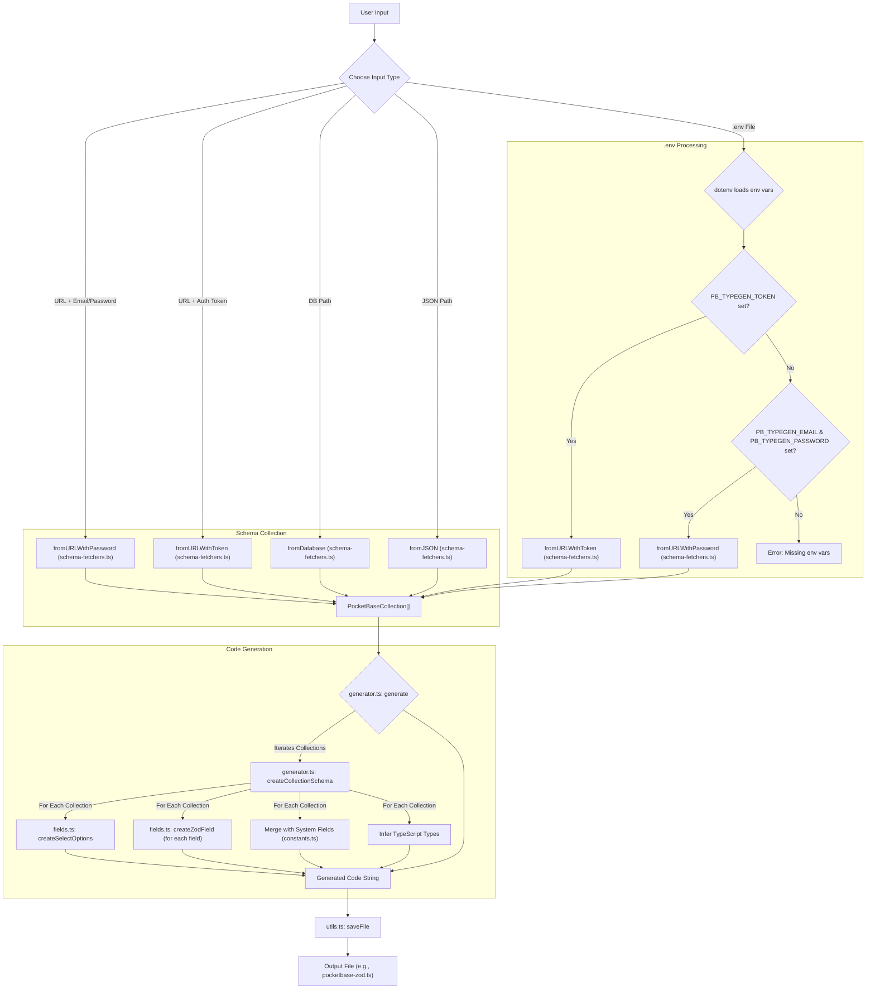

# PocketBase Zod Generator

Generate Zod schemas from PocketBase collections with proper select field enum support.

[](https://badge.fury.io/js/pocketbase-zod-generator)
[](https://opensource.org/licenses/MIT)

## ✨ Features

- **🎯 Complete Zod Schema Generation**: Converts PocketBase collections into fully typed Zod schemas
- **🔗 Enum Support**: Properly handles select fields with enum constants for type safety
- **🔄 Multiple Input Sources**: Supports API endpoints, SQLite databases, and JSON files
- **🛡️ Type Safety**: Full TypeScript support with proper type definitions
- **📦 Easy Integration**: Works seamlessly with existing PocketBase projects

## 🚀 Installation

### Global Installation (Recommended for CLI usage)
```bash
npm install -g pocketbase-zod-generator
```

### Local Installation
```bash
npm install pocketbase-zod-generator
# or
yarn add pocketbase-zod-generator
# or
pnpm add pocketbase-zod-generator
```

## 📖 Usage

### CLI Usage

#### Using Environment Variables (Recommended)
Create a `.env` file in your project root:
```env
PB_TYPEGEN_URL=http://127.0.0.1:8090
PB_TYPEGEN_EMAIL=admin@example.com
PB_TYPEGEN_PASSWORD=your-password
# OR use a token instead of email/password
PB_TYPEGEN_TOKEN=your-auth-token
```

Then run:
```bash
pocketbase-zod-generator --env
```

#### Direct API Connection
```bash
# With email/password
pocketbase-zod-generator --url http://127.0.0.1:8090 --email admin@example.com --password your-password

# With auth token
pocketbase-zod-generator --url http://127.0.0.1:8090 --token your-auth-token
```

#### From Local Database
```bash
pocketbase-zod-generator --db ./pb_data/data.db
```

#### From JSON Export
```bash
pocketbase-zod-generator --json ./schema.json
```

#### Custom Output Path
```bash
pocketbase-zod-generator --env --out ./src/lib/pocketbase-types.ts
```

### Programmatic Usage

```typescript
import { generateZodSchemas } from 'pocketbase-zod-generator';

// Generate schemas from API
const schemas = await generateZodSchemas({
  url: 'http://127.0.0.1:8090',
  email: 'admin@example.com',
  password: 'your-password',
  out: './pocketbase-zod.ts'
});

// Generate from database file
const schemas = await generateZodSchemas({
  db: './pb_data/data.db',
  out: './pocketbase-zod.ts'
});

// Generate from JSON
const schemas = await generateZodSchemas({
  json: './schema.json',
  out: './pocketbase-zod.ts'
});
```

## 📋 Generated Schema Example

Given a PocketBase collection with select fields, the generator creates:

```typescript
// Enum constants for select fields
export const UsersRoleOptions = ["admin","editor","viewer"] as const;
export const PostsStatusOptions = ["draft","published","archived"] as const;

// Zod schemas
export const UsersRecordSchema = z.object({
  id: z.string(),
  email: z.string().email(),
  role: z.enum(UsersRoleOptions).optional(),
  name: z.string().optional(),
  avatar: z.string().optional(),
  created: IsoDateString.optional(),
  updated: IsoDateString.optional(),
});

export const UsersResponseSchema = UsersRecordSchema.merge(AuthSystemFieldsSchema);

// TypeScript types
export type UsersRecord = z.infer<typeof UsersRecordSchema>;
export type UsersResponse = z.infer<typeof UsersResponseSchema>;
```

## ⚙️ Binding Generation Process

Below is a diagram illustrating the process of generating Zod schemas from PocketBase collections:



**Brief Explanation:**

1.  **User Input**: The process starts with the user providing input. This can be:
    *   Direct PocketBase instance details: URL and admin email/password, or URL and an admin auth token.
    *   A path to a local PocketBase SQLite database file (`--db` option).
    *   A path to a JSON schema file exported from PocketBase (`--json` option).
    *   Via a `.env` file (`--env` option), which should contain `PB_TYPEGEN_URL` and either `PB_TYPEGEN_TOKEN` or `PB_TYPEGEN_EMAIL` & `PB_TYPEGEN_PASSWORD`.
2.  **Schema Fetching (`src/schema-fetchers.ts`)**:
    *   Depending on the input method, a specific function is called to retrieve the collection definitions:
        *   `fromURLWithPassword`: For URL and email/password credentials.
        *   `fromURLWithToken`: For URL and auth token.
        *   `fromDatabase`: For SQLite database path.
        *   `fromJSON`: For JSON file path.
    *   If using `.env`, the script first checks for `PB_TYPEGEN_TOKEN`. If present, `fromURLWithToken` is used. Otherwise, it checks for `PB_TYPEGEN_EMAIL` and `PB_TYPEGEN_PASSWORD` and uses `fromURLWithPassword`.
    *   All these functions ultimately return an array of `PocketBaseCollection` objects representing the schema.
3.  **Code Generation (`generator.ts`):**
    *   The `generate` function takes the fetched schemas.
    *   It iterates through each collection, calling `createCollectionSchema`.
    *   `createCollectionSchema` then:
        *   Generates enum constants for `select` fields using `createSelectOptions` (from `src/fields.ts`).
        *   Creates Zod schema definitions for each field within a collection using `createZodField` (from `src/fields.ts`).
        *   Merges the generated record schema with appropriate system field schemas (e.g., `id`, `created`, `updated`) defined in `src/constants.ts`.
        *   Infers TypeScript types from the Zod schemas.
    *   All these generated pieces are combined into a single TypeScript code string.
4.  **Output**: The `saveFile` utility (from `src/utils.ts`) writes this code string to the specified output file (e.g., `pocketbase-zod.ts`).

## 🔧 CLI Options

| Option | Description | Default |
|--------|-------------|---------|
| `--env [dir]` | Use environment variables from .env file | - |
| `--url <url>` | PocketBase instance URL | - |
| `--email <email>` | Admin email (use with --url) | - |
| `--password <password>` | Admin password (use with --url) | - |
| `--token <token>` | Auth token (use with --url) | - |
| `--db <path>` | Path to PocketBase SQLite database | - |
| `--json <path>` | Path to exported JSON schema | - |
| `--out <path>` | Output file path | `pocketbase-zod.ts` |
| `--help` | Show help | - |
| `--version` | Show version | - |

## 🌟 Key Features

### Select Field Enum Support
Unlike other generators, this tool properly handles PocketBase select fields by creating typed enum constants:

```typescript
// Before: Generic string type
status: z.string().optional()

// After: Properly typed enum
status: z.enum(PostsStatusOptions).optional()
```

### Comprehensive Field Type Support
- ✅ Text, Number, Boolean
- ✅ Email, URL validation
- ✅ Date/DateTime with proper ISO string typing
- ✅ Select fields with enum generation
- ✅ File uploads (single/multiple)
- ✅ Relations (single/multiple)
- ✅ JSON fields
- ✅ Rich text (Editor)
- ✅ Auto-generated fields

### Multiple Data Sources
- **API Connection**: Direct connection to running PocketBase instance
- **Database File**: Read directly from SQLite database
- **JSON Export**: Use schema exported from PocketBase admin UI

## 🤝 Attribution

This project builds upon the excellent work of [pocketbase-typegen](https://github.com/patmood/pocketbase-typegen) by @patmood. The core schema processing logic and PocketBase integration patterns are adapted from that project.

**Key improvements in this project:**
- ✨ Added proper Zod schema generation (vs TypeScript interfaces)
- 🔗 Fixed select field enum support with proper API fetching
- 🛡️ Added comprehensive TypeScript types
- 🔧 Improved error handling and validation

## 📄 License

MIT License - see [LICENSE](LICENSE) file for details.

## 🐛 Issues & Contributing

Found a bug or want to contribute? Please visit our [GitHub repository](https://github.com/martinblasko/pocketbase-zod-generator).

## 🔗 Related Projects

- [PocketBase](https://pocketbase.io/) - Open Source backend in 1 file
- [Zod](https://github.com/colinhacks/zod) - TypeScript-first schema validation
- [pocketbase-typegen](https://github.com/patmood/pocketbase-typegen) - Original TypeScript interface generator